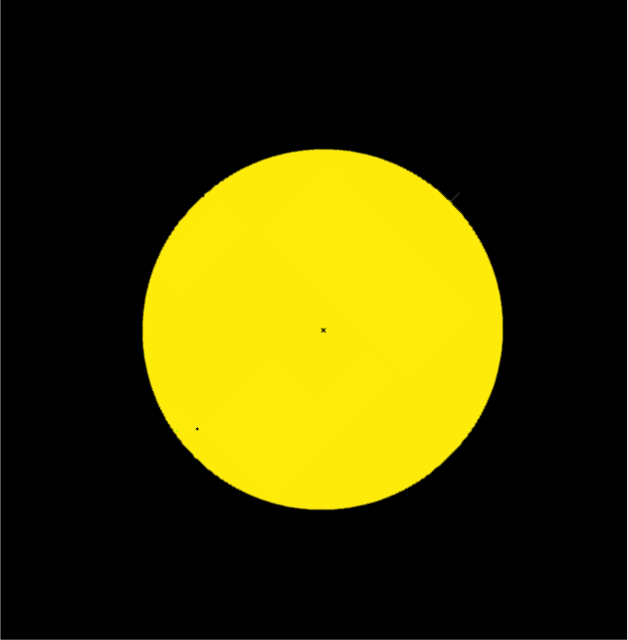
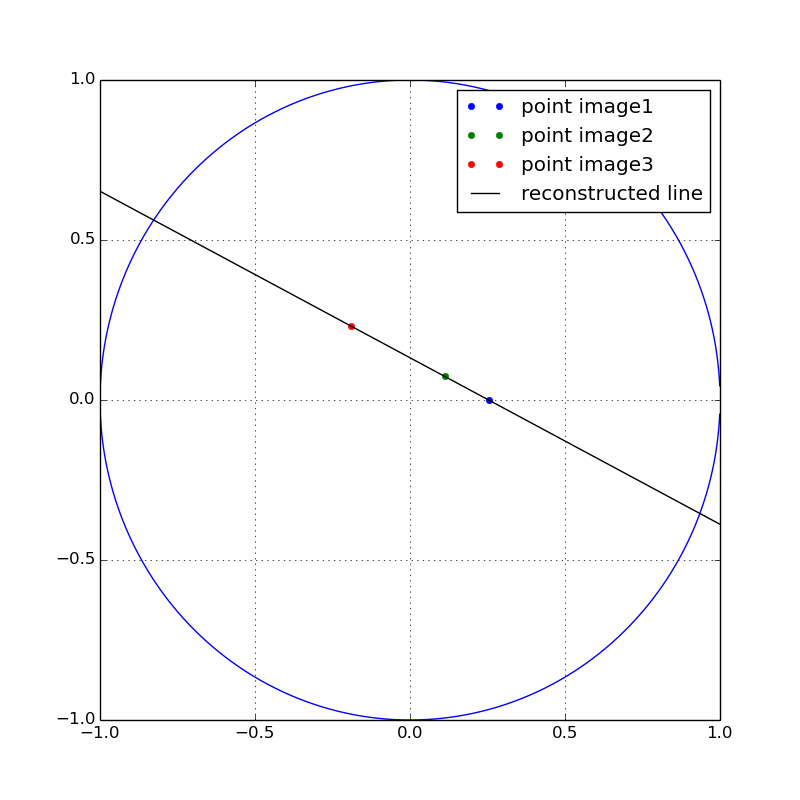

# From-Altazimutal-Image-to-Ecuatorial-with-Three-Points

The objective: Create a program to reconstruct the observed movement of mercury in an equatorial mount from just 3 images taken in an altazimuth mount with its respective capture times. 

## Getting Started

A first sketch about the explanation of the project can be found in: 

http://bit.ly/2FpRWBO

At the moment the program take three images similar to this one: 

with the respective times in which the photo was made and then output a graph as the following to show what was the result obtained in a cirlce of radius 1:

### Prerequisites

To run this program you only need to have installed the folowing libaries of python: matplotlib.pyplot, matplotlib.cm, scipy.misc
and numpy.

## Running the the program

To run it succesfully you could modify the folling parameters: 

1. The name of the images that are in the list "ls" inside "project.py"; this ones must be in the same directory than the file when you are going to run it. 
2. t1 and t2 inside "project.py". Here, t1 is the time between the image ls[1] and ls[0], and t2 is the time between ls[2] and ls[1].

## Built With

* [Python](https://www.python.org/) 

## Authors

* **Andrés Felipe Gómez** - *Initial work* -

## License

This project is licensed under the MIT License - see the [LICENSE.md](LICENSE.md) file for details

## References

* [Python](https://www.python.org/) 
* [Operations with images in python] https://www.youtube.com/watch?v=ZByPsn4o7vs 
* [Images used as input] Jubier, X. (2016). Mercury Transit Calculator - Xavier Jubier.Xjubier.free.fr. Retrieved 4 April 2016, from http://goo.gl/9q9yNd

## Acknowledgments

* Thanks to my team Juan Esteban Zuluaga, Luis Correa, Jose Alejandro Osorio, Alvaro Guerreo, and especially to Jorge Iván Zuluaga because for him this has been possible.

